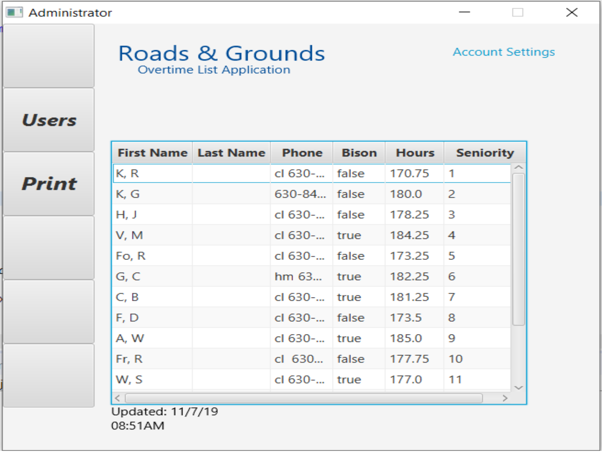

Fermitracker is a project that was created by myself and a group of classmates (Aaron Corral, Kristen Hirst, Brandon Thezan) during the Fall 2019 Semester. We implemented this project both to help out customer and satisfy requirements for out Java 3 Class. Following the course conclusion, I worked with Josh Juneau to begin implementing the application into the fermilab server system. 

The application is coded in Java, and connects to a MySql database. It has been converted over to Oracle to work with the Fermilab Databases. 

The application allows for users to login with a separate login per user, then is split up into 2 account sets. There is a users account and a management account. Users can view the hours list, see info, and sort the list, with no changes being saved to the page. Management can add/edit/remove employees, edit hours, sort the list, print the list, and other manager exclusive features.
 
Source: <a href="https://github.com/Joe-Konen/Grounds-Overtime-List-Application"><i class="large github icon"></i>Fermitracker</a>
